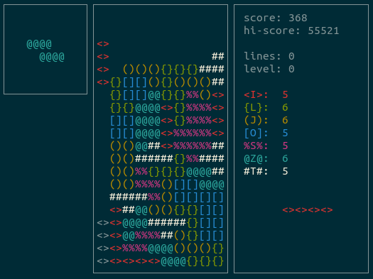

# e-type
e-type is a customizable Tetris clone for your terminal.

## Why?
The idea of making this came to mind in my quest of finding a decent terminal Tetris clone. After 30 minutes of searching I noticed that there weren't
as many Tetris clones as I initially thought there would be, and most of them were pretty basic with close to no customization available. Then I thought
to myself "Why look for one if I can just make it?", and that's the story of how e-type came to life. /:>

## Screenshots


## Building
e-type depends solely on ncurses for terminal drawing which can be easily installed by using you preferred package manager. (If you dont already have it)

to compile just run:

```
make
```
And to run:
```
./e-type
```

## Controls
| Key | Action |
| --- | --- |
| s   | SOFT DROP |
| a   | LEFT |
| d   | RIGHT |
| j   | ROTATE CLOCKWISE |
| k   | ROTATE COUNTER-CLOCKWISE |
| f   | HOLD |
| space | HARD DROP |
| q   | QUIT |

